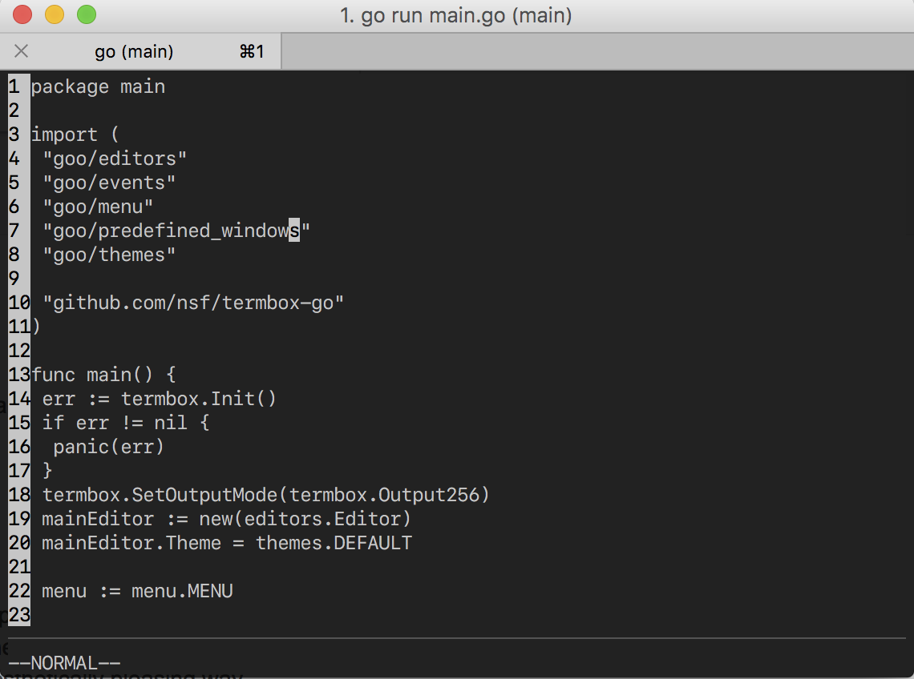
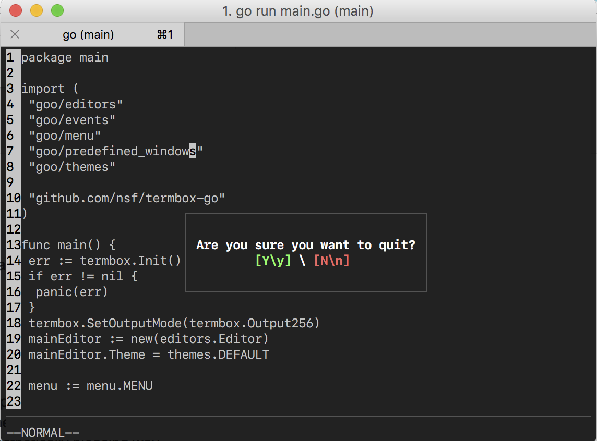

# Goo

## Vim like editor written in Go using the termbox library.
- Normal and Insert mode
- Vim keybinding for navigations - h,j,k,l also ctrl-a and ctrl-i
- Vertical and horizontal scrolling
- Has cursor boundaries
- Toggle lines
- Spacemacs like menu ( triggered with the spacebar )

Screenshot 1:

Screenshot 2:

